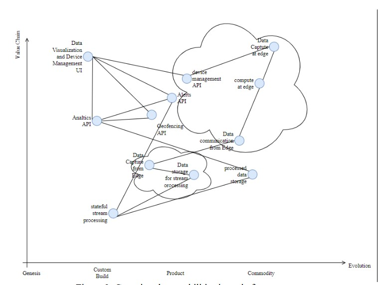
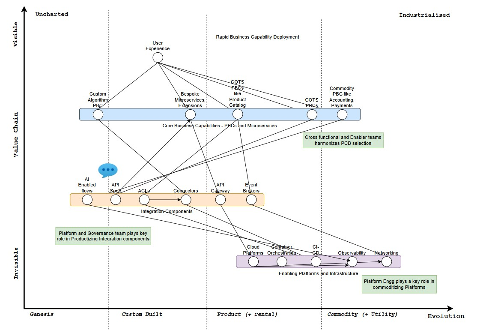
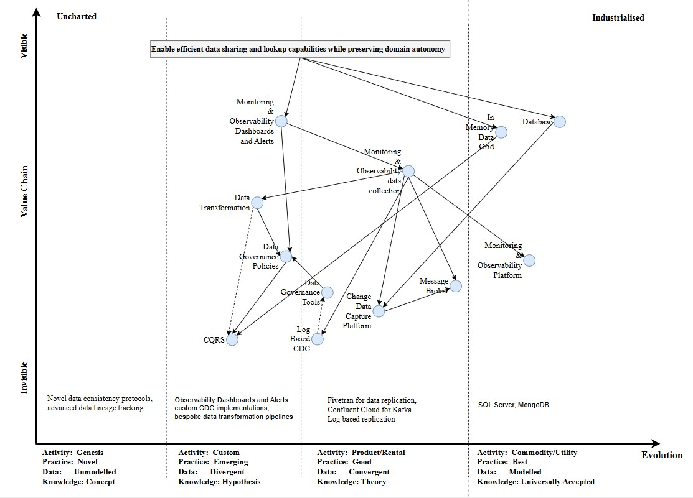
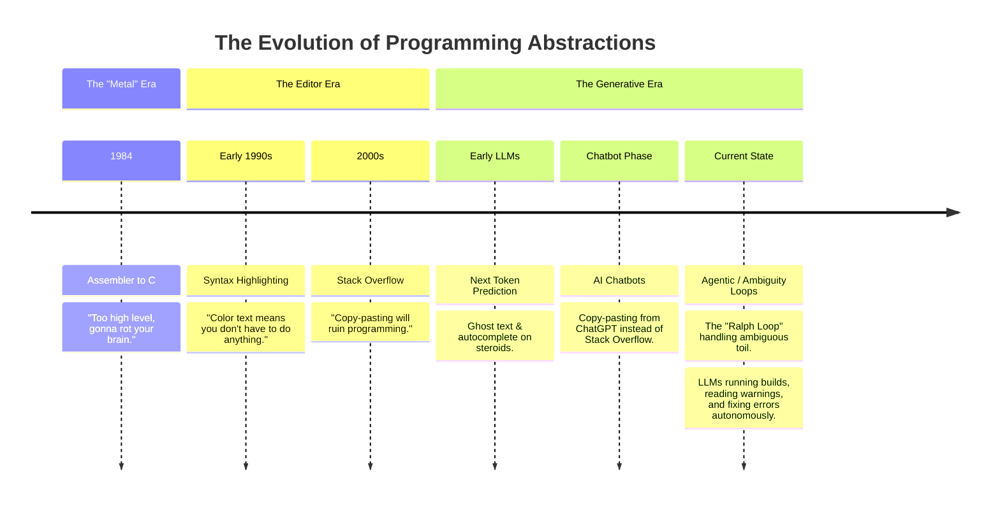
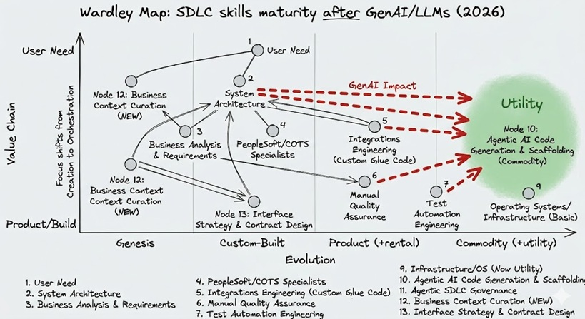

# Importance of visual analysis in strategy

Strategy Analysis is a process of analyzing the environment and the organization to identify opportunities and threats and evolution of the systems. SWOT is an example of strategy analysis.

## Why visual analysis is important in strategy

Visual analysis gives an edge to the strategist to understand the environment and the organization and convey the isight to the stakeholders in a way that is easy to understand and act upon.

# Enter Wardley Mapping

I dont intend to explain what Wardley Mapping, better to hear this from the horse's mouth through his Medium channel [Wardley Maps](https://medium.com/wardleymaps) and [Github repo](https://github.com/swardley/WARDLEY-MAP-REPOSITORY).   

## Why I love Wardley Mapping

I was introduced to Wardley Mapping when I wanted to evaluate the IoT ecosystem for a project where I was working as an Integration Architect and decided to use my experience in an Industry reaserch on its usage in Equipment Rental Industry. Finding the right tool was a mini research in itself, however I am glad that I stumbled upon it and it has been a game changer for me in understanding the strategy and evolution of systems ever since and have used it in various capacities and in different domains.

# Examples of Wardley Maps

## Component Correlation Strategy

Here is an example of Wardley Mapping for the IoT ecosystem for the Equipment Rental Industry. Here I had used it just understand the correlation among the platform components

## Strategy Evolution
Here is an example of Wardley Mapping for the Compasable Commerce ecosystem analysis in stablishing a new platform for the Retail Industry using Packaged Business Capabilities (PBC) and MACH architecture.

## Strategy Evolution

This Wardley Map is used stablish component evolution and relationships while creating an autonomous domain data sharing strategy

# Lets try to use Warley mapping in a simple use case

## Evolution of Programming

### This is atimeline view using Mermaid

## Lets re-evaluate the above timeline using the principles of Wardley Mapping

### Evaluation of programming pre-GenAI era

### Evaluation of programming post-GenAI era

### Why the Wardley Mapping makes much more sense

As you can see, its easier to represent a simple timeline view of programming skills evolution over the period of time through a Mermaid timeline view, however Wardley map makes it much easier to understand the evolution of the programming skills and how some skills are evolving or converging to a newer and related skill set.

## More examples

### AI Skill Gap and the Value Pivot

1. Genesis (High Uncertainty / Unique Value)

    - Context Architecture: This is currently the "Wild West." Since every company’s internal data (the "Context") is unique, building the systems to feed AI agents is a custom, high-alpha activity.

    - Multi-agent Decomposition: We are still inventing the "patterns" for how agents talk to each other. This is not a commodity yet; it requires experimental architectural thinking.

2. Custom Built (High Complexity / Differentiator)

   - Evaluation & Quality Judgment: This is your "Master Goldsmith" territory. You can't buy a generic "accuracy checker" for a bespoke business logic. You must build custom automated testing suites to catch "confident hallucinations."

    - Failure Pattern Recognition: This requires deep tribal knowledge of how your specific stack fails (e.g., context degradation in long-running threads).

3. Product / Rental (Standardizing)

    - Specification Precision (Prompting/SDR): While vital, this is rapidly moving toward the right. Better models (like O1 or Claude 3.5) are becoming better at "intent extraction," reducing the need for "prompt engineering" as a standalone elite skill.

    - Trust & Security Design: We are seeing the rise of "Guardrail-as-a-Service" products. While you must implement them, the tools are becoming products.

4. Commodity (Utility)

    - Cost & Token Economics: This is becoming pure math and "FinOps." As model prices drop and standardized calculators emerge, this becomes a baseline operational requirement rather than a specialized "skill."

### Challenges in assembling AI teams

The map illustrates several critical challenges for organizations today:

- The Translation Gap: The most critical strategic bottleneck is "translators"—roles that act as essential bridges between highly structured Business Goals and highly uncertain AI Models. The map positions this gap as the primary area of strategic focus.

- Managing Different Evolution Rates: The x-axis highlights that while underlying Infrastructure is a commodity, AI Models are still in the Genesis stage. This means teams must manage high uncertainty in their core technology while demanding efficient predictability in their business outcomes.

- Balancing Custom and Product: Organizations are caught between Custom Built Data Pipelines (which offer tailored solutions but high complexity) and Productized AI Platforms (Copilots) (which offer standardizing and lower cost). The Socio-Technical System (Management Framework) is essential for integrating these diverse platform types.

# Conclusion

I have been using Wardley Mapping for a few years now and I have found it to be a very useful tool for understanding the evolution of systems and the components and their relationships.

# References

 - [Wardley Maps](https://medium.com/wardleymaps)
 - [Wardley Maps Github repo](https://github.com/swardley/WARDLEY-MAP-REPOSITORY)
 - [Your Strategy Needs a Visual Metaphor](https://hbr.org/2026/02/your-strategy-needs-a-visual-metaphor)
 - [The AI Job Market Split in Two. One Side Pays $400K and Can't Hire Fast Enough.](https://www.youtube.com/watch?v=4cuT-LKcmWs&t=377s)
 - [The AI Job Market Split in Two. One Side Pays $400K and Can't Hire Fast Enough.](https://www.youtube.com/watch?v=4cuT-LKcmWs&t=377s)
 - [How to Assemble Teams for Tomorrow’s AI-Driven Challenges](https://www.youtube.com/watch?v=xOU4VZGbkLM&t=248s)
 
